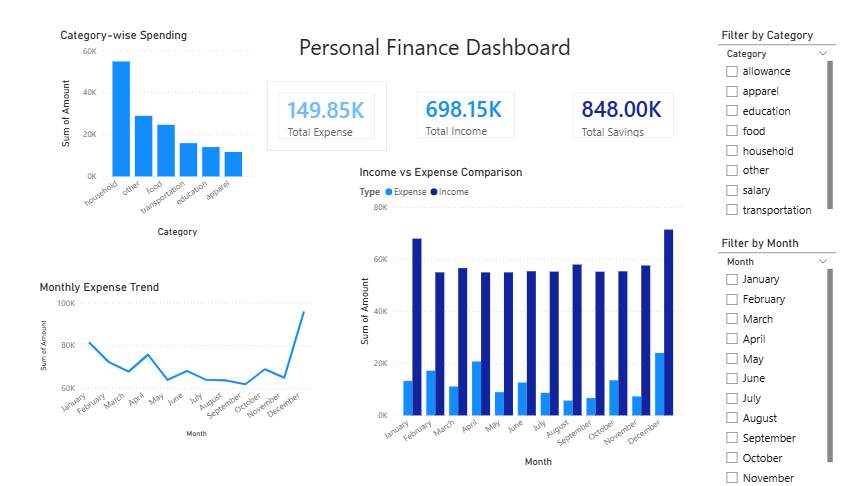

# Personal Finance Analytics Project

## Objective
Analyze personal financial data to understand spending patterns and improve budgeting.

## Tools Used
- Python (Pandas, NumPy, Matplotlib, Seaborn)
- Power BI
- Scikit-learn

## Features
- Data Cleaning & Preprocessing
- Exploratory Data Analysis (EDA)
- Category-wise and Monthly Analysis
- Interactive Dashboard using Power BI
- Expense Prediction using Linear Regression

## Insights
- Household expenses dominate overall spending
- Monthly spending trends show fluctuations
- Positive savings observed across months

## Project Structure
- Data
- Notebook
- Visuals
- Dashboard

## Outcome
Built a data-driven solution to track expenses and improve financial decision-making.

